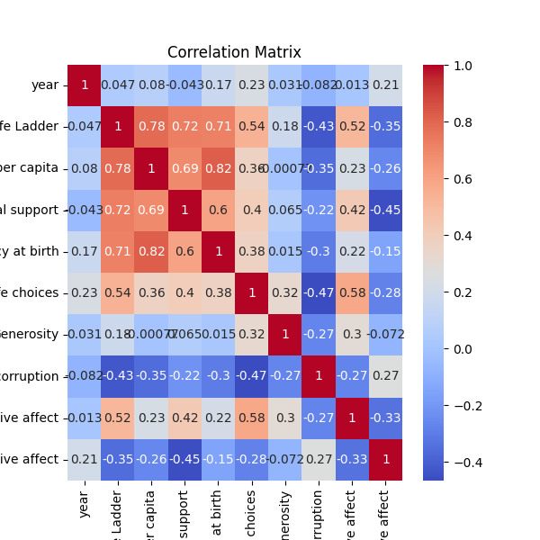

# Automated Analysis Report

## Summary

                                   count unique        top freq        mean       std     min     25%     50%      75%     max
Country name                        2363    165  Argentina   18         NaN       NaN     NaN     NaN     NaN      NaN     NaN
year                              2363.0    NaN        NaN  NaN  2014.76386  5.059436  2005.0  2011.0  2015.0   2019.0  2023.0
Life Ladder                       2363.0    NaN        NaN  NaN    5.483566  1.125522   1.281   4.647   5.449   6.3235   8.019
Log GDP per capita                2335.0    NaN        NaN  NaN    9.399671  1.152069   5.527  8.5065   9.503  10.3925  11.676
Social support                    2350.0    NaN        NaN  NaN    0.809369  0.121212   0.228   0.744  0.8345    0.904   0.987
Healthy life expectancy at birth  2300.0    NaN        NaN  NaN   63.401828  6.842644    6.72  59.195    65.1  68.5525    74.6
Freedom to make life choices      2327.0    NaN        NaN  NaN    0.750282  0.139357   0.228   0.661   0.771    0.862   0.985
Generosity                        2282.0    NaN        NaN  NaN    0.000098  0.161388   -0.34  -0.112  -0.022  0.09375     0.7
Perceptions of corruption         2238.0    NaN        NaN  NaN    0.743971  0.184865   0.035   0.687  0.7985  0.86775   0.983
Positive affect                   2339.0    NaN        NaN  NaN    0.651882   0.10624   0.179   0.572   0.663    0.737   0.884
Negative affect                   2347.0    NaN        NaN  NaN    0.273151  0.087131   0.083   0.209   0.262    0.326   0.705

## Missing Values

Country name                          0
year                                  0
Life Ladder                           0
Log GDP per capita                   28
Social support                       13
Healthy life expectancy at birth     63
Freedom to make life choices         36
Generosity                           81
Perceptions of corruption           125
Positive affect                      24
Negative affect                      16

## Insights from GPT-4o-Mini

Based on the provided summary of the dataset, several insights and suggestions for further analysis can be extracted:

### Insights:

1. **Country Diversity**: The dataset contains information from 165 unique countries, with Argentina being the most frequent entry (18 occurrences). This suggests a possible over-representation of certain countries, which may skew analysis. 

2. **Temporal Coverage**: The year ranges from 2005 to 2023, with a mean around 2014.76. It would be beneficial to examine if there are trends over the years in factors like Life Ladder, GDP, or social support.

3. **Life Ladder Scores**: The mean Life Ladder score is approximately 5.48 with a maximum of 8.02 and a minimum of 1.28. This suggests a diverse range of well-being as captured by the Life Ladder. The distribution of this variable could be further examined using histograms.

4. **Economic Indicators**: The Log GDP per capita has a mean of approximately 9.40, indicating a moderate economic status across the dataset's sample. The range (from 5.527 to 11.676) reflects significant economic disparities amongst countries.

5. **Social Support**: The average Social Support score is 0.81, suggesting a generally supportive social environment, although there are outliers and missing data (13 values). Evaluating the relationship between social support and Life Ladder could be insightful.

6. **Corruption Perceptions and Affects**: The data reveals a lower perception of corruption (mean = 0.74) and higher negative affect (mean = 0.27) on average. Analyzing how these factors influence the Life Ladder could yield valuable insights.

7. **Generosity Trends**: The Generosity score is an intriguing variable with a mean very close to zero, and a maximum of only 0.7. This may point towards societal challenges or a focus on survival over altruistic actions, particularly in lower GDP countries.

### Suggestions for Further Analysis:

1. **Correlation Analysis**: Examine correlation coefficients between variables to identify potential relationships, particularly:
   - Between Life Ladder and other variables (GDP, Social Support, Positive and Negative Affect).
   - Between GDP and social support.

2. **Time-Series Analysis**: Conduct a time-series analysis to observe trends over the years in Life Ladder, GDP, and Social Support scores.

3. **Handling Missing Data**: Since there are missing values in several critical variables, consider employing imputation techniques or sensitivity analyses to understand the impact of these missing values on conclusions drawn from the dataset.

4. **Comparative Analysis**: Segment the data by region (if geographic data is available), and compare indicators among different regions to understand disparities better.

5. **Regression Analysis**: Conduct regression analysis to discern the factors that most significantly predict the Life Ladder scores and understand the impact of each predictor.

6. **Category Comparisons**: If categorical data (such as GDP categories) can be created from Log GDP per capita, perform comparative analyses to see differences in well-being measures across different GDP categories.

7. **Outliers Examination**: Investigate potential outliers in key variables (like Life Ladder or GDP) to see if they represent unique cases or noise in the dataset.

8. **Visualization**: Create visualizations (box plots, scatter plots, heatmaps) to aid in identifying relationships in the data and to summarize findings in a more digestible manner.

By following through with these analyses and suggestions, you would be able to provide deeper insights into the underlying patterns and trends present in your dataset, and potentially highlight areas for policy-making or further research.

## Visualizations

