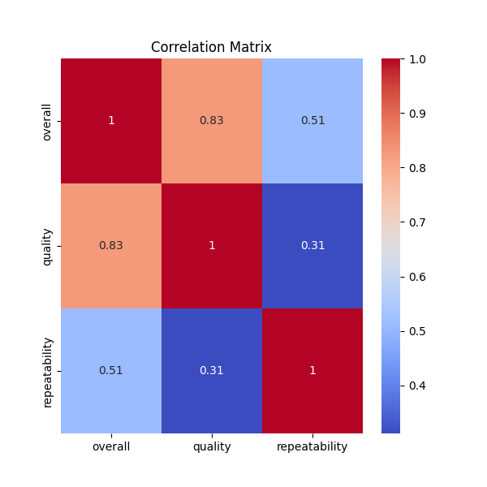

# Automated Analysis Report

## Summary

                count unique                top  freq      mean       std  min  25%  50%  75%  max
date             2553   2055          21-May-06     8       NaN       NaN  NaN  NaN  NaN  NaN  NaN
language         2652     11            English  1306       NaN       NaN  NaN  NaN  NaN  NaN  NaN
type             2652      8              movie  2211       NaN       NaN  NaN  NaN  NaN  NaN  NaN
title            2652   2312  Kanda Naal Mudhal     9       NaN       NaN  NaN  NaN  NaN  NaN  NaN
by               2390   1528  Kiefer Sutherland    48       NaN       NaN  NaN  NaN  NaN  NaN  NaN
overall        2652.0    NaN                NaN   NaN  3.047511   0.76218  1.0  3.0  3.0  3.0  5.0
quality        2652.0    NaN                NaN   NaN  3.209276  0.796743  1.0  3.0  3.0  4.0  5.0
repeatability  2652.0    NaN                NaN   NaN  1.494721  0.598289  1.0  1.0  1.0  2.0  3.0

## Missing Values

date              99
language           0
type               0
title              0
by               262
overall            0
quality            0
repeatability      0

## Insights from GPT-4o-Mini

Based on the dataset summary you've provided, here are some insights and suggestions for further analysis:

### Insights:
1. **Date Distribution**:
   - The dataset consists of 2553 entries recorded by date, with a unique count of 2055 dates. The top entry is from May 21, 2006, and this date might represent a significant event or a starting point.
   - You might want to check for trends over time, such as the distribution of entries across different years, or if there's a seasonality effect (e.g., are there more entries around certain dates).

2. **Language**:
   - The dataset has 11 unique languages, with English being the most frequent language (1306 occurrences). This suggests a significant skew toward English content.
   - An analysis of which languages are less represented could provide insights into diversity in the dataset.

3. **Type of Content**:
   - The 'type' field reveals that the majority of entries are movies (2211 occurrences), indicating a possible focus on film content.
   - Exploring the characteristics of these types (if the dataset contains other types like TV shows, documentaries, etc.) could be beneficial.

4. **Title Popularity**:
   - The most frequently occurring title is "Kanda Naal Mudhal," which appears 9 times. Understanding why some titles appear frequently (e.g., remakes, different versions, etc.) might provide insights into trends in the dataset.

5. **Creators**:
   - The "by" field has 2390 entries representing 1528 unique creators, with Kiefer Sutherland being the most frequent creator (48 appearances). This could indicate that certain individuals have more output in the dataset.
   - An analysis of creator contributions could be valuable, such as looking at the diversity of creators represented or the most prolific ones.

6. **Ratings**:
   - The overall ratings mean is approximately 3.05, with a standard deviation of 0.76, indicating moderate variability in ratings.
   - The quality ratings have a higher mean of approximately 3.21, suggesting that users might perceive quality somewhat more favorably than overall ratings.

7. **Repeatability**:
   - The repeatability mean is 1.49 with a skew towards lower values (predominantly 1). This indicates that most entries are not duplicated or are referenced only once, suggesting uniqueness in the dataset.

### Missing Values:
- The 'date' column has 99 missing entries, which is about 4% of the total entries. While 'language', 'type', 'title', 'overall', 'quality', and 'repeatability' have no missing entries, 'by' has 262 (about 10%) missing entries.
- Addressing missing data for 'date' might be crucial for time-series analyses, and looking into why 'by' has missing creators can also be insightful.

### Suggestions for Further Analysis:
1. **Trend Analysis**:
   - Perform time-series analysis on the date variable to observe trends, patterns, and seasonality in entries over time.

2. **Content Diversity**:
   - Analyze the diversity of the 'language' and 'type' fields to assess representation. Visualizing language usage over time might also be insightful.

3. **Creator Contributions**:
   - Investigate the contributions of various creators, identifying the most prolific and successful ones based on overall and quality ratings.

4. **Correlation Analysis**:
   - Analyze how overall ratings correlate with quality ratings. Furthermore, explore the relationship between repeatability and the ratings to identify any patterns.

5. **Handle Missing Values**:
   - Use imputation methods or further investigate the missing 'date' entries and analyze the potential impact of those missing values on overall trends.

6. **Visualization**:
   - Create visual representations (e.g., histograms, pie charts, box plots) for the distribution of ratings, types, languages, and other categorical variables to enhance understanding.

7. **Sentiment Analysis (if text data is available)**:
   - If there is textual data (e.g., reviews or descriptions), you could perform sentiment analysis to gauge how sentiment correlates with ratings.

8. **Exploring Top Items**:
   - Delve deeper into the characteristics of the most common titles and creators to understand trends and potential reasons for their popularity.

By pursuing these analyses, you can gain a deeper understanding of the dataset and extract actionable insights related to content diversity, user engagement, and overall trends.

## Visualizations

